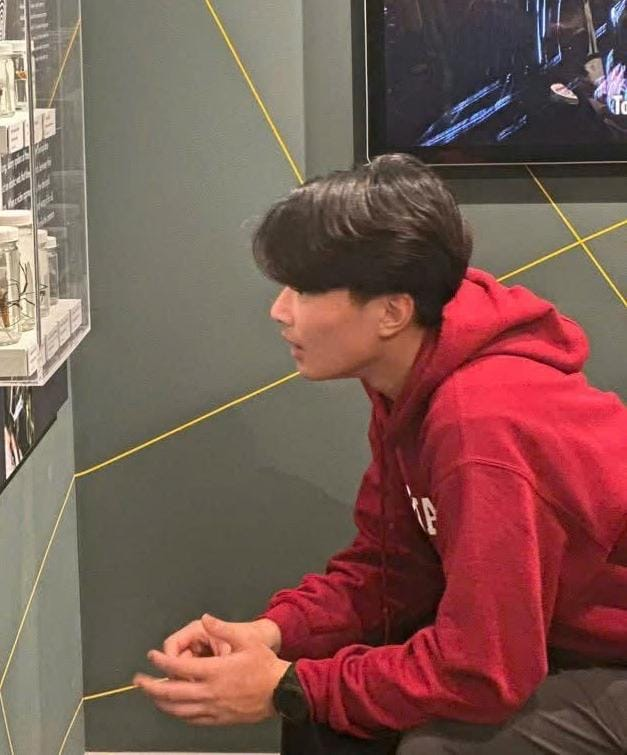
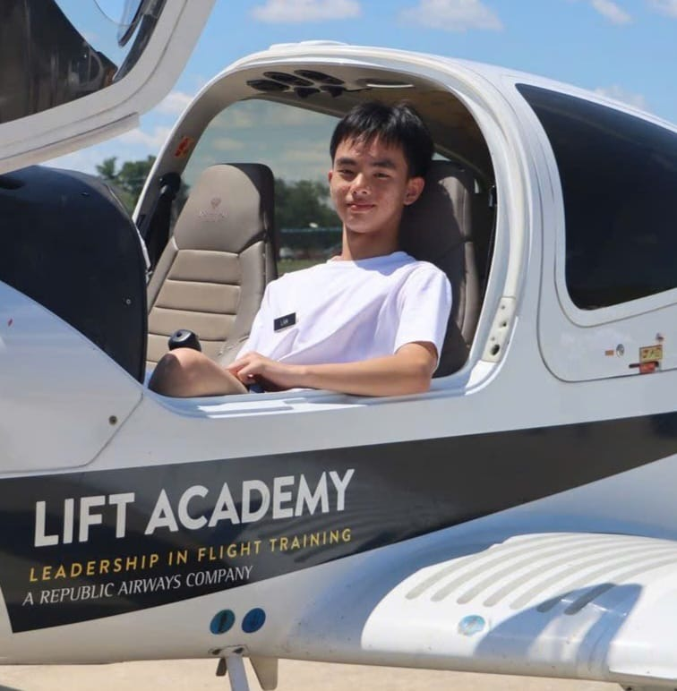
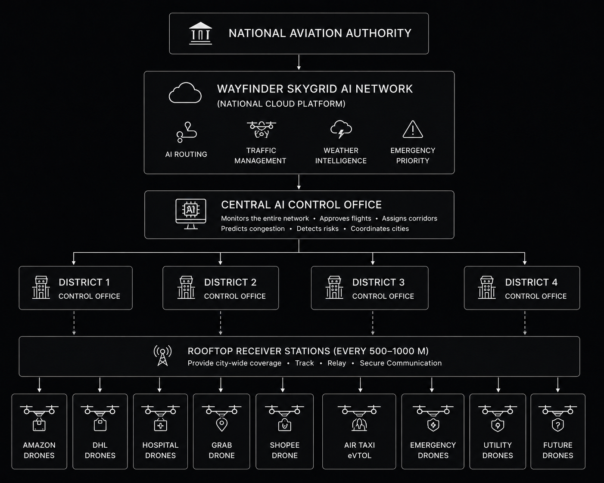

# 🌍 STEM CHALLENGE: PAINTING THE FUTURE OF SMART SOCIETY 2045

Welcome, young founding teams, to your final Capstone Project repository and management workspace! This is where your team will digitize your ideas, architect technological solutions, and build your "investment pitch profile" for the upcoming **Demo Day (Future Tech Showcase)**.

---

## 🛠️ STUDENT GUIDE (READ CAREFULLY BEFORE PROCEEDING)

### 1. How to Initialize Your Team's Project from This Template
* **Step 1:** The Team Representative (Team Leader/CEO) clicks the green **"Use this template"** button in the top right corner ➔ Select **"Create a new repository"**.
* **Step 2:** Name your Repository using the following syntax: `Class_TeamName_ProjectName` (e.g., `STEM02_GreenBrain_WasteSorting`). Set the visibility to **Public**.
* **Step 3:** Go to **Settings** ➔ **Collaborators** ➔ Click **Add people** to invite all team members and your Mentor(s) to co-manage the repository.

### 2. Weekly Submission Roadmap (3-Week Timeline)
* ⏰ **Deadline:** 11:59 PM every Saturday.
* 📦 **Submission Method:** Teams upload image files/documents to the designated directories and update the corresponding content in **[PART II]** below.

| Week | Tasks & Deliverables | Directory to Update on GitHub |
| :--- | :--- | :--- |
| **Week 1 (July 11)** | **Ideation Brainstorming & Systems Thinking Mapping** - Allocate the 5 core roles within the team. - Select 1 major societal challenge (Pollution, Traffic, Healthcare, etc.). - Map out the cause-and-effect system diagram. | 📁 Upload the diagram image to: `/research_system` 📝 Complete the team profile in sections **1** and **2** below. |
| **Week 2 (July 25)** | **Startup Architecture & Technological Solutions** - Define Startup Name, Slogan, and Target Customers. - Propose a solution integrating core technologies (AI, Robotics, IoT, etc.). - Self-evaluate the project idea based on the 50-point matrix. | 📝 Update solution details and technological frameworks in sections **3** and **4** below. |
| **Week 3 (August 1)** | **Smart Society Visual Conception & Final Slide Deck** - Finalize the 2045 Smart Society Visual Conception Drawing. - Synthesize the "Reflection & Knowledge Discovery" section. - Prepare a 15-minute pitch deck for Demo Day. | 📁 Upload the conceptual drawing to: `/design_visuals` 📁 Upload the pitch deck (PDF) to: `/pitch_deck` 📝 Complete all remaining sections below. |

*Note: Once your team is familiar with the workflow, you may delete **PART I** (Student Guide) and keep only **PART II** (Startup Profile) as the main landing page of your project repositor.*

---

# [PART II] STARTUP PROFILE: THE CHRONICLES OF ARCHITECTING SMART SOCIETY 2045

*Students begin documenting their team project from this point forward. Replace placeholder brackets `[...]` with your team's actual information.*

## 🚀 1. STARTUP NAME: Wayfinder
* **Slogan:** "Guiding Tomorrow's Skys."
* **Class:** STEM.02.26

### 👥 Co-Founding Team (5 Core Roles - 5 Pillars of Synergy)
1. **Henry Mach Herzog** - **CEO (Chief Strategist):**
* **Identity Image / Profile Picture:** []
* **Responsibilities:** Leads the project, develops the startup concept, integrates all sections, and coordinates the final presentation.
2. **Nguyen Tuan Khai** - **Social Researcher:**
* **Identity Image / Profile Picture:** []
* **Responsibilities:** Researches the problem, gathers evidence, and develops the systems thinking analysis.
3. **Lâm Trí Khang** - **Technology Architect:**
* **Identity Image / Profile Picture:** []
* **Responsibilities:** Explains how the Wayfinder SkyGrid system operates and creates the technical concepts and diagrams.
4. **Tran Ha Chi** - **UX/Experience Designer:**
* **Identity Image / Profile Picture:** []
* **Responsibilities:** Designs the branding, illustrations, dashboard, diagrams, and all visual content for the README and presentation.
5. **Minh Dat** - **Venture Investor:**
* **Identity Image / Profile Picture:** []
* **Responsibilities:** Develops the business model, market analysis, feasibility study, and commercialization strategy.

---
## ⚠️ 2. PROBLEM STATEMENT & SYSTEMS THINKING ANALYSIS
* **Core Problem Statement:** Drone traffic congestion in the skys.
* **Cause-and-Effect Deep Dive:**
  * *Root Causes:* Demand for autonomous aircraft transport, new regulations enabling autonomous flight, cheaper drones and AI, urbanization and road congestion,instant delivery demand.
  * *Direct Consequences:* Risk of drone collision in the sky, airspace congestion, emergency response delays, inefficient routing, accidents and noise complaints, stricter regulations.

*Detailed Systems Thinking Map*

---

## 💡 3. STARTUP ARCHITECTURE & BUSINESS MODEL
* **Target Customers:** Logistics and delivery companies, Emergency services and hospitals, Local governments and smart-city authorities, and Future air-taxi operators
(NOT PRIVATE PERSONAL DRONES)

* **Startup's Core Solution:** Wayfinder SkyGrid is a startup concept for an automated low-altitude air traffic management platform for smart cities. Inspired by traditional Air Traffic Control (ATC), it uses AI to coordinate commercial delivery drones, emergency response drones, and future passenger air taxis using airways, or “droneways”. A city-wide network of rooftop receiver stations continuously receives data from registered drones, while a Central Control Office supervises the airspace and intervenes only when necessary.

* **Core Technology Stack (Check all applicable technologies):**
  * [ x ] **AI Vision (Computer Vision):** AI analyzes real-time drone telemetry, airspace conditions, weather, and traffic patterns to predict conflicts, optimize routes, and automate low-altitude air traffic management.
  * [ x ] **Robotics/UAVs & Actuators:** Coordinates commercial delivery drones, emergency response drones, and future passenger eVTOL aircraft through automated flight routing, drone highways, and priority management.
  * [ x ] **IoT & Cloud Infrastructure:** A city-wide network of rooftop receiver stations streams live drone telemetry to a centralized cloud platform, enabling continuous monitoring, communication, and AI-powered traffic coordination.
  * [ x ] **Green Energy (Sustainability):** Supports zero-emission electric drone transportation by optimizing flight routes, reducing energy consumption, and enabling sustainable urban logistics and emergency services.
  * [ x ] **Big Data & Predictive Analytics:** Processes large-scale flight, weather, and traffic data to forecast airspace congestion, prevent collisions, optimize drone routes, and improve overall network efficiency.

---

## 🎨 4. SMART SOCIETY VISUAL CONCEPTION 2045
*Describe your future vision when the startup's solution is widely integrated into modern urban life.*

*Team's Conceptual Drawing*

---

## 🧠 5. REFLECTION & KNOWLEDGE DISCOVERY
Following a 3-week journey of intensive co-creation, our founding team has distilled the following key insights:
* **We discovered that:** The number of drones are growing extremely fast and will reach more than 25 million global commercial drones in the near future
* **We learned that:** Technology is most effective when it works alongside people. By combining AI automation with human supervision, Wayfinder SkyGrid creates a safer, more efficient, and more trustworthy urban airspace management system.
* **Our most unique innovation/competitive edge is:** Wayfinder SkyGrid is a city-wide AI-powered air traffic management platform that coordinates drones from all operators through intelligent drone highways, real-time routing, and automated conflict prevention—rather than each company managing its own isolated drone network. This unites all systems in one!

---

## 📊 6. PROJECT IDEA SELF-EVALUATION MATRIX (Max: 50 Points)
*The founding team reviews, deliberates, and grades the project according to official Demo Day criteria:*

| Criteria | Maximum Points | Team Self-Score | Rationale & Justification |
| :--- | :---: | :---: | :--- |
| **1. High-Impact Problem Solving** | 10 | `10/10` | Addresses the emerging challenge of managing large-scale urban drone traffic, improving safety, emergency response, and future smart-city mobility. |
| **2. Innovation & Creativity** | 10 | `9/10` | Introduces an AI-powered city-wide drone traffic management platform with drone highways, automated routing, and a unified airspace network for multiple operators. |
| **3. Feasibility & Scalability** | 10 | `8.5/10` | The concept builds on existing AI, drone, and communication technologies, but large-scale deployment depends on regulatory approval, infrastructure investment, and industry adoption. |
| **4. Social & Community Impact** | 10 | `10/10` | Improves public safety, enables faster emergency response, reduces congestion, and supports the development of sustainable smart cities. |
| **5. Business Viability & Marketability** | 10 | `9/10` | Multiple revenue streams, including government licensing, enterprise subscriptions, and airspace usage fees, create a scalable business model with strong long-term market potential. |
| **TOTAL SCORE** | **50** | `46.5/50` | |

---
🌐 *Project profile meticulously curated by **Wayfinder** in preparation for the **Future Tech Showcase - Demo Day**.*
